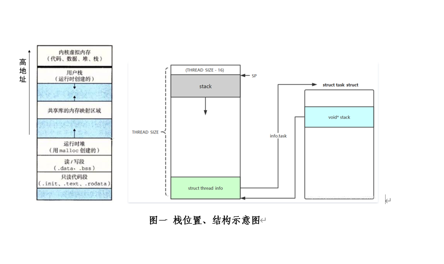
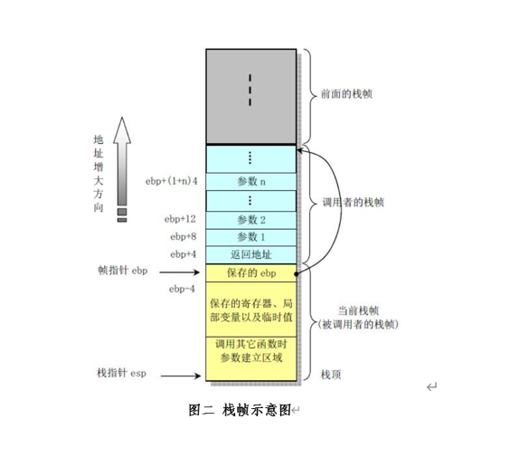
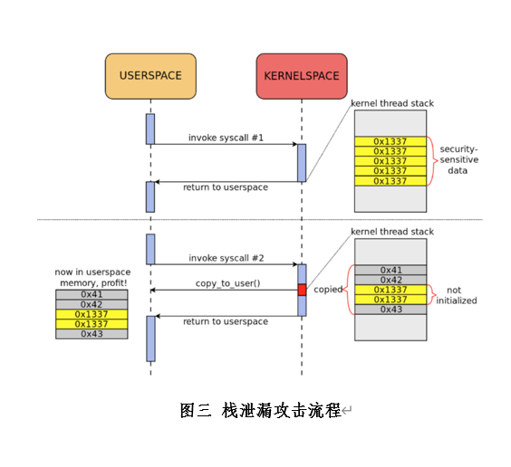
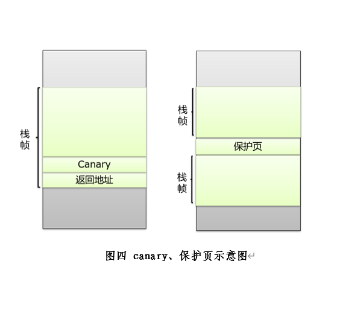

内核栈的安全
<br />一、介绍
<br />&emsp;&emsp;进程中的栈不同于C语言中的栈，它是用于存储进程运行过程中所需参数、局部变量等的一段内存，它在进程创建时由内核分配。每个进程会有两个栈，一个是用户栈，存在于用户空间，另一个是内核栈，存在于内核空间。由于这两个栈具有不同的权限，攻击者往往对内核栈更充满兴趣，寻找内核栈的缺陷或漏洞进行攻击篡改，达到提权的目的，从而进一步对系统进行攻击。
<br />1.栈地址空间
<br />&emsp;&emsp;栈地址分配是从高地址向低地址方向增长，根据需要由编译器自动分配一段连续的内存空间，其中内核栈位于内核空间，用户栈位于用户空间的栈区域。它们在使用时根据栈底（BP）和栈顶（SP）指针来收缩和扩张。

<br />&emsp;&emsp;其中进程栈地址存于PCB中，即task_struct结构中的stack变量中，而thread_info、task以及stack由联合体定义，共享THREAD_SIZE/sizeof(long)大小的内存空间，并且thread_info位于最后一段固定位置，由它可进一步获取进程所有信息（如cred），这为内核安全埋下隐患。
```
union thread_union {
#ifndef CONFIG_ARCH_TASK_STRUCT_ON_STACK
    struct task_struct task;
#endif
#ifndef CONFIG_THREAD_INFO_IN_TASK
    struct thread_info thread_info;
#endif
    unsigned long stack[THREAD_SIZE/sizeof(long)];
};
```
```
struct task_struct {
...
void      *stack;
...
}

```

<br />2.栈帧
<br />&emsp;&emsp;栈帧保存着栈在进程运行过程中存放着相关的参数、变量以及返回地址，它们按照“后进先出”的规则压入栈中，根据变量定义的顺序以及结构体的布局等，可推测出它们在栈中的相对位置。其中最受攻击者关注的是返回地址和函数指针，它们可以引导程序的跳转，以达到相应目的。
<br />
<br />二、安全问题
<br />&emsp;&emsp;基于栈的布局及特性的掌握，攻击者根据这些规律性的特点来攻击内核栈，不仅可以选择性地读取栈内数据，还可以通过缓冲区溢出的方法对栈进行写入。其安全性主要体现在两个方面：栈泄漏和栈写入。它一方面窃取了栈内的安全相关信息，另一方面又往栈内写入恶意数据，使得攻击者通过对栈的控制来入侵整个系统。
<br />1.栈泄漏
<br />&emsp;&emsp;程序在运行过程中，栈内存的分配与释放是通过SP指针的移动来实现，并不会对其重新初始化，上一次使用的数据始终存在于内存中，只有当前的程序进行初始化或重新写入覆盖才会改变。所以，只要掌握栈的内存布局，便可以读出指定内存地址的数据，尤其是安全相关的数据（如密钥信息、canary值等）。
<br />&emsp;&emsp;栈泄漏的根源是由于内存未初始化，即便进行了初始化，对于结构体而言，由于成员变量大小不同，需满足字节对齐要求，仍存在填充字节部分的数据残；其次是由于内存布局的规律性。由于操作系统代码十分庞大复杂，由于性能上的考虑，若运行时同步进行内存的清理工作或是破坏其在内存中的布局规律，许多不必要的操作将会带来极大系统性能开销。所以对于变量、结构体等操作使用过程中，会存在着这些漏洞被攻击者所利用。 
例如下述攻击：
```
void syscall_1(){
    int key;    /安全相关的敏感信息
    ...
}
```
```
void syscall_2(int *buffer, ... ){
    int leak[LEN];    /未初始化
    ...
    copy_to_user( buffer ,leak , LEN );
    ...
}
```
```
void main(){
    int get[LEN];   /用于接收泄漏数据
    ...
    syscall_1();    /调用需要攻击的系统调用
    syscall_2( get , ... ); /返回泄漏数据
    ...
}
```
<br />&emsp;&emsp;攻击者为了获取目标系统调用过程中的数据（如密钥），首先调用它使其在内核空间运行，将数据残留在内核栈中。其次，寻找一个使用了未定义变量的系统调用，其中包含着从内核空间向用户空间进行数据传递。通过这个具有漏洞的系统调用执行，便可以将目标系统调用的残留信息携带出来。
<br />
<br />2.栈写入
<br />&emsp;&emsp;由于对内存写入的过程中，缺乏对写入数据长度的检查，超出规定长度的额外数据被继续写入后续的内存中，通过特定的偏移量精确控制某一恶意数据写入至某一特定的位置（如返回地址），使得原有的数据被人为篡改，程序可被跳转到指定地方执行。
<br />&emsp;&emsp;栈写入的根源是由于缓冲区溢出攻击的威胁。由于内核空间和用户空间需要进行数据交换，我们没办法避免对于内核栈的写入，攻击者就利用写入的漏洞，如缺乏写入长度检验、缺乏溢出的检测等等，通过“缓冲区溢出”的方式将恶意代码写入指定位置。这种溢出可能在栈内，仅对栈内的数据进行覆写，也可将偏移量超出栈的范围，对栈外的数据进行覆写。 
<br />&emsp;&emsp;例如，cred 结构体作为整个操作系统安全的重要的结构，其中的uid、gid控制着系统权限，若用户对uid、gid进行写入攻击，将其值修改为0，那么就可以获取root权限，进行更多的非法操作。
<br />三、解决方法
<br />&emsp;&emsp;为了解决内核栈的安全问题，即需要防止栈泄漏，又要遏制栈写入。从源头上，要切断暴露源，以最小的代价及时清理掉不用的敏感数据并消除其内存空间中的规律性布局；从途径上，要增强检验策略，增加恶意写入对抗机制，切断可能存在的恶意写入途径。
<br />1.栈泄漏
<br />&emsp;&emsp;栈随机化。通过KASLR技术将栈的基地址随机化，从基地址开始分配一段连续空间，其栈内地址是连续的，但栈起始地址是随机的。这样打乱了栈的内存布局规律，栈间的相对偏移也变得随机，这大大提高了攻击者对栈地址猜测的难度。
<br />&emsp;&emsp;结构体随机化。由于结构体中包含着许多变量，尤其是敏感数据、函数指针等，它们根据定义的先后顺序，其内存中的布局是确定的，只要掌握结构体首地址便可将所有内部成员的地址计算出来。基于栈随机化是对整个栈地址空间这个大环境进行随机化，而结构体随机化则是在其内部进一步随机化。通过编译器插件，在编译时将结构体内的成员按一定随机算法随机排列并分配内存，通过designated initializers机制可实现对结构体成员的按名字乱序访问。
<br />&emsp;&emsp;栈清除。在内核栈的使用过程中，一是及时发现并初始化未定义变量，二是及时清除不再使用的敏感数据。如PAX_MEMORY_SANITIZE ，将敏感数据标记，在内存释放时将标记的数据清除。该方法想法虽然好，但将敏感数据标记，便额外的向攻击者提供了敏感数据的特征，便可以通过标记来定位目标。为此，这个机制有利有弊；又如PAX_MEMORY_STACKLEAK，在系统调用结束后，调用stackleak_erase()函数对栈进行清除；还有UniSan（ Uninitialized Data Leak Sanitizer)，通过LLVM进行静态分析，从分配内存到与用户空间数据交互，找出所有未定义的变量并添加初始化操作。
<br />&emsp;&emsp;如Linux中系统调用时对于栈的清除。
<br />&emsp;&emsp;内核态返回到用户态：
```
ret_to_user:
   …
finish_ret_to_user:
    enable_step_tsk x1, x2
#ifdef CONFIG_GCC_PLUGIN_STACKLEAK
    bl  stackleak_erase		/处理完返回前相关操作，在退出内核态前将栈清除
#endif
    kernel_exit 0
```
&emsp;&emsp;栈清除函数：
```
asmlinkage void notrace stackleak_erase(void)
{
  …
/* 将选定范围栈地址赋值固定值以清除栈数据 */
    while (kstack_ptr < boundary) {
        *(unsigned long *)kstack_ptr = STACKLEAK_POISON;
        kstack_ptr += sizeof(unsigned long);
    }
  …
}
```
<br />2.栈写入
<br />&emsp;&emsp;canary值。在栈的返回地址前添加一个canary变量，该canary为进程创建时生成的一个随机数，存在于task_struct结构的canary变量中。一旦栈被缓冲区溢出写入并越过了canary变量，那么也就威胁到了返回地址。为此内核在执行返回地址跳转前，需要对canary值进行确认，基于canary值的随机性，攻击者不知道其具体的值，所以无法写入正确的值来骗过内核的检测。只有验证canary值与task_struct结构中的canary一致，才认为是安全的，否则canary改变，则意味着返回地址是恶意构造的，内核应立即做出处理。
<br />
<br />&emsp;&emsp;cnary的位置：
```
struct thread_info {
    …
unsigned long       stack_canary;
…
}
```

&emsp;&emsp;cnary初始化：
```
static __always_inline void boot_init_stack_canary(void)
{
    unsigned long canary;
    get_random_bytes(&canary, sizeof(canary));		/产生随机数
    canary ^= LINUX_VERSION_CODE;
    current->stack_canary = canary;					/存入PCB
    __stack_chk_guard = current->stack_canary;
}
```
&emsp;&emsp;cnary判断处理：
```
8010fb1c:     e51b2030      ldr   r2, [fp, #-48]  /当前栈的canary值
8010fb20:     e5943000      ldr   r3, [r4]		/PCB中存储的canary值
8010fb24:     e1520003      cmp   r2, r3			/比较
8010fb28:     1a000020      bne   8010fbb0		/不正确则跳转至处理函数
...
8010fbb0:     eb006738      bl    80129898 <__stack_chk_fail>
```
<br />&emsp;&emsp;保护页（Guard page）。相对canary用于保护栈内的安全，保护页（4KB大小）用于保护栈间的安全。在不同栈间添加保护页，该页映射到空地址，一旦缓冲区溢出写超出栈的范围，并试图写入相邻的栈，这时会先写入保护页，因为往一个空地址写入而触发异常被内核发现。虽然保护页可以阻挡连续写带来的攻击，但依然存在栈冲突（Stack Clash），通过可变长数组，分配一段大于保护页的内存，直接越过保护页进行写入，而不会触发对保护页的写入。至此，为了进一步阻挡攻击，则需要扩大保护页的大小，这显然不现实，那么就需要解决可变长数组的问题，从linux4.17到4.20版本就已经实现了可变长数组在内核中的移除工作，同时，在对类似于可变长数组这里变量的内存分配时，添加边界检测，防止超出栈的地址范围。这样一来也能消除了保护页的隐患。
<br />&emsp;&emsp;影子栈（shadow stack）。影子栈就是栈的备份，其中存储着程序的返回地址。在程序执行时，将返回地址同时存在当前栈内和影子栈内，在程序执行返回时，需要检验当前栈内 的返回地址和影子栈内的返回地址是否一致，以此确保返回地址的安全。
<br />&emsp;&emsp;写入检查。在对内存的写入过程中，添加相应的检查机制，包括长度检查、边界检查、权限检查等。涉及到写入的函数如copy_from/to user这对函数，需要在写入调用前进行写入字符串长度检查判断，同时需要检查是否具有相应的Capility权限，以及写入后是否会超出原有的栈的地址范围。
<br />&emsp;&emsp;栈的安全问题远非表面上的那么简单，由于栈是用于进程运行过程中的参数、变量的存放，我们不能仅仅考虑其安全方面，性能也是不容忽视的环节。除非架构或硬件等本质上的大改动，否则对于栈的安全往往都是通过一个个新功能的添加来实现，一个个堆砌而形成的保护网，为此，整个栈的安全是需要一定性能代价换来的，栈的安全是在和性能的平衡上逐步的发展。

<br />参考资料：
<br />https://a13xp0p0v.github.io/2018/11/04/stackleak.html

